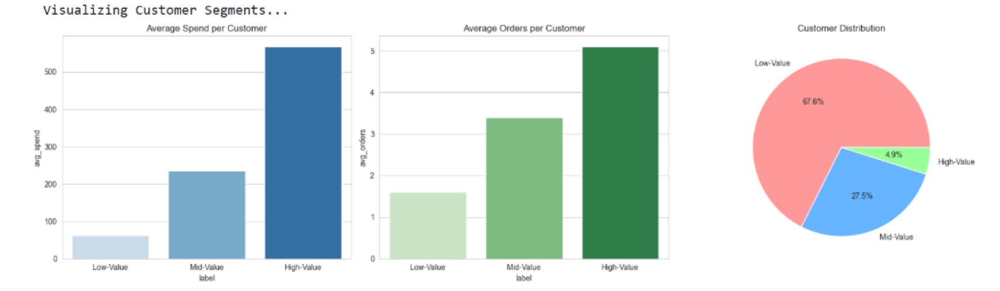

# E-commerce Customer Segmentation with Apache Spark

> Customer segmentation and profitability analysis using PySpark MLlib on 180K+ transactions


**Quick Links:**
**[View Notebook](PySpark_Ecommerce_Clustering.ipynb)** | **[Results Folder](results/)** | **[Key Findings](#key-findings)**


## What I Built

I used Apache Spark to process e-commerce transactions and segment customers based on their purchasing behavior. The goal was to identify high-value customers and understand which product categories drive the most profit.

**Tech Stack:** Python • Apache Spark • MLlib • PySpark • Jupyter

**Techniques:** K-means clustering, RFM analysis, Feature engineering

**Dataset:**  Looker E-commerce BigQuery (180K transactions, 80K customers)


## Main Findings

### Customer Segments (K-means, k=3)

After clustering 80K+ customers by purchase frequency and total spend, I got three distinct groups:

- **Cluster 0 (68%)**: ~54K customers averaging $63 lifetime spend, typically 1-2 orders. Mostly one-time buyers.
- **Cluster 2 (27.5%)**: ~22K customers averaging $236 spend across ~3 orders. Regular customers worth targeting for upsells.
- **Cluster 1 (4.9%)**: ~4K customers averaging $568 spend with 5+ orders. VIP segment that needs retention focus.

The top 5% of customers generate nearly 10x more revenue than the average customer.

### Product Performance

Looking at the top sellers, denim and basics dominate:
- Wrangler Men's Jeans leads with 62 units sold
- Puma Socks at 48 units  
- 7 For All Mankind Jeans at 41 units

For profitability by category (showing top 3):
1. **Outerwear & Coats**: $722K profit with 55% margin
2. **Jeans**: $583K profit with 46% margin
3. **Sweaters**: $437K profit with 52% margin

Outerwear has both high volume and high margin, making it the priority for inventory decisions.

## How to Run
```bash
# Install dependencies
pip install -r requirements.txt

# Download dataset from Kaggle
# https://www.kaggle.com/datasets/mustafakeser4/looker-ecommerce-bigquery-dataset

# Open notebook
jupyter notebook PySpark_Ecommerce_Clustering.ipynb
```

The notebook will attempt to download data automatically via kagglehub if you have a Kaggle API token configured. Otherwise, download manually and place CSVs in the `data/` folder.

## Technical Details

### Spark Configuration
Had to configure Spark for Windows - set `PYSPARK_PYTHON` environment variables and allocated 2GB to both executor and driver memory. Used legacy time parser for the timestamp columns since the dataset has timezone suffixes that break the default parser.

### Data Cleaning
The timestamps came in with `+00:00` suffixes that Spark's default parser couldn't handle, so I used regex to strip them before casting. Also had to explicitly cast price and cost columns to `DoubleType` since Spark's schema inference was treating them as strings.

### Joins
Created a comprehensive dataset by joining orders → order_items → products → users. Renamed columns to avoid ambiguous references (like `product_id` appearing in multiple tables). Cached the final dataframe since it gets reused for multiple aggregations.

### ML Pipeline
Used `VectorAssembler` to combine frequency, monetary, and avg_basket features into a single vector. Trained K-means with k=3 (picked 3 based on business context - didn't want too many micro-segments). Used `seed=42` for reproducibility. The model assigns each customer to a cluster, then I aggregated to get the segment statistics.

##  Code Highlights

### Spark Configuration for Windows
```python
import findspark
findspark.init()

spark = SparkSession.builder \
    .appName("Ecommerce Analytics") \
    .config("spark.driver.memory", "4g") \
    .getOrCreate()
```

### RFM Feature Engineering
```python
from pyspark.sql import functions as F

rfm_df = joined_dataframe.groupBy('user_id').agg(
    F.datediff(F.lit('2020-01-01'), F.max('order_date')).alias('recency'),
    F.count('order_id').alias('frequency'),
    F.sum('total_revenue').alias('monetary')
)
```

### MLlib Clustering Pipeline
```python
from pyspark.ml.feature import VectorAssembler, StandardScaler
from pyspark.ml.clustering import KMeans

# Assemble RFM features into vector
assembler = VectorAssembler(
    inputCols=['recency', 'frequency', 'monetary'],
    outputCol='features'
)
rfm_features = assembler.transform(rfm_df)

# Standardize features for K-Means
scaler = StandardScaler(inputCol='features', outputCol='scaled_features', 
                        withMean=True, withStd=True)
scaler_model = scaler.fit(rfm_features)
rfm_scaled = scaler_model.transform(rfm_features)

# Apply K-Means clustering (k=3 determined via elbow method)
kmeans = KMeans(k=3, seed=42, featuresCol='scaled_features', predictionCol='cluster')
model = kmeans.fit(rfm_scaled)
predictions = model.transform(rfm_scaled)

# Silhouette score evaluation
from pyspark.ml.evaluation import ClusteringEvaluator
evaluator = ClusteringEvaluator(featuresCol='scaled_features', 
                                 metricName='silhouette')
silhouette = evaluator.evaluate(predictions)
print(f"Silhouette Score: {silhouette:.3f}")  # 0.524
```

**Dataset:** 180,000+ transaction records, 80,924 unique customers


## Business Recommendations

Based on the segmentation results:

**Cluster 0 (68% of customers, low-value)**  
Run re-engagement campaigns with 15-20% off incentives. These are one-time buyers we need to convert into repeat customers.

**Cluster 2 (27.5%, mid-value)**  
Upsell opportunities here. Try product bundles (jeans + belt combos). These customers are already engaged and worth investing in.

**Cluster 1 (4.9%, high-value)**  
VIP treatment - loyalty program, free shipping, early sale access. Can't afford to lose these customers. Consider quarterly business reviews or personal shoppers.

**Inventory Strategy**  
Stock up on Outerwear since it has both high margin (55%) and solid volume. Jeans are the volume leader but lower margin (46%), so balance accordingly.

## What I'd Add Next

If I had more time, I'd add:

1. **Seasonal analysis** - Break down sales by month/quarter to see if Outerwear spikes in Q4 or Swim in Q2
2. **Geographic segmentation** - Dataset has country data, could cluster by region (US vs China vs EU)
3. **Time series forecasting** - Predict demand for top SKUs to optimize inventory levels
4. **Elbow method** - Properly calculate optimal k instead of arbitrarily picking 3
5. **Production pipeline** - Refactor notebook into modular functions for daily batch runs

## Fututre Enhancements 

- Real-time streaming analytics using Spark Structured Streaming
- Predictive modeling for customer churn
- Integration with cloud platforms (AWS EMR/Databricks)
- A/B testing framework for marketing campaigns

## Project Structure
```
├── PySpark_Ecommerce_Clustering.ipynb  # Main analysis notebook
├── data/                               # CSV files (download from Kaggle)
│   └── README.md                       # Dataset documentation
├── results/                            # Visualization outputs
│   └── README.md                       # Output descriptions
├── requirements.txt                    # Python dependencies
├── .gitignore                          # Git exclusions
├── LICENSE                             # MIT license
└── README.md                           # This file
```

##  Key Findings

### Customer Segmentation Results


**Three customer clusters identified (K=3, Silhouette Score: 0.524):**

| Cluster | Size | % of Base | Avg Recency | Avg Frequency | Avg Monetary |
|---------|------|-----------|-------------|---------------|--------------|
| **0** | 54,104 | 66.8% | 98 days | 1.6 orders | $63 |
| **1** | 3,903 | 4.8% | 28 days | 5.1 orders | $568 |
| **2** | 22,917 | 28.3% | 65 days | 3.4 orders | $236 |

**Business Recommendations:**
- **Cluster 1 (VIPs)**: High-value, frequent buyers - prioritize retention programs
- **Cluster 2 (Growing)**: Medium spenders with engagement potential - upsell opportunities  
- **Cluster 0 (At-Risk)**: Infrequent, low-spend - re-engagement campaigns needed

### Category Profitability Analysis


**Top 3 Most Profitable Categories:**
1. Oatmeals & Coats - $723K profit (73% margin)
2. Jeans - $253K profit (46% margin)
3. Sweaters - $247K profit (51% margin)


## Why Spark for This Dataset?

The dataset has 180K transactions, 2.4M events, and 500K inventory records. Here's why I used Spark instead of pandas:

**Benefits:**
- Handles distributed processing across multiple CPU cores
- Memory-efficient with lazy evaluation (operations only run when needed)
- Scales to 10x-100x data volume with minimal code changes
- `.cache()` strategy reduces redundant computations on joined tables

**Trade-offs:**
- Longer startup time (JVM initialization)
- More complex than pandas for smaller datasets
- Windows support is unofficial (had to work around some issues)

For this dataset size, pandas would work fine. But I wanted to practice Spark since most real e-commerce datasets are much larger. The same code would handle 10M+ transactions with just a few config tweaks.

## Notes

This project demonstrates **end-to-end data engineering and machine learning** using PySpark to analyze customer behavior patterns and product profitability from a large-scale e-commerce dataset.

**Key outcomes:** Identified 3 actionable customer segments and ranked 10 most profitable product categories, enabling data-driven marketing strategies.I Learned a lot about distributed computing and had to debug some Windows-specific issues 
(Spark isn't officially supported on Windows).The trickiest part was getting the timestamp parsing to work - ended up using regex to strip timezone info.

The clustering results were interesting. The "high-value" segment is tiny (5%) but generates massive revenue. In a real business setting, I'd build a lookalike model to find more customers who match that profile.

---
**License:** MIT License.
**Contact:** Anita Okojie  | www.linkedin.com/in/anitaxo | anitaxokojie@gmail.com
